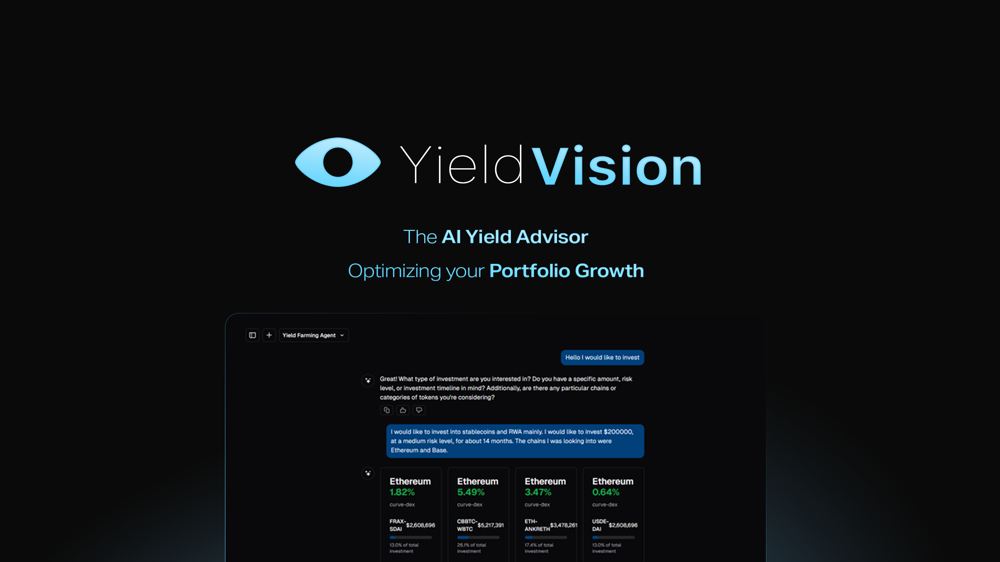

# 🌟 Yield Vision - AI-Powered DeFi Investment Advisor

A sophisticated DeFi investment platform that leverages artificial intelligence and multi-agent systems to provide personalized yield farming strategies across the DeFi ecosystem.



## 🚀 Key Features

### 📊 Comprehensive DeFi Analytics

- Real-time data from 100+ blockchain networks
- Analysis of 1000+ DeFi protocols
- Monitoring of 10,000+ liquidity pools
- Advanced risk assessment and opportunity scoring
- Integration with DeFiLlama for live protocol metrics

### 🤖 Advanced AI Architecture

- Multi-Agent RAG (Retrieval Augmented Generation) system
- Local LLAMA 3.1 model deployment for strategy generation
- GPU-accelerated processing for real-time analysis
- Not just another GPT wrapper - fully autonomous system
- Custom-trained models for DeFi risk assessment

### 🔒 Secure Vector Storage

- Dual vector database system using Qdrant and Pinecone
- High-performance protocol matching
- Efficient similarity search for investment opportunities
- Real-time data indexing and updates
- Secure storage of protocol analysis vectors

### 💼 Risk Analysis Engine

Comprehensive protocol assessment based on:

- Historical TVL patterns
- Token volatility metrics
- User adoption rates
- DeFiLlama forecast scores
- Smart contract audit status
- Protocol age and reliability
- Community engagement metrics

### 🎯 Smart Investment Strategies

- Personalized risk profiling through user assessment
- Custom strategy generation based on preferences
- Portfolio diversification recommendations
- Investment timeline optimization
- Automated rebalancing suggestions

### 💫 User-Friendly Interface

- Custom UI built on OpenWeb UI framework
- Interactive investment cards
- Real-time portfolio monitoring
- Performance analytics dashboard
- Mobile-responsive design

### 👛 Seamless Wallet Integration

- One-click investment deployment
- Support for multiple wallet providers
- Direct protocol interaction
- Transaction monitoring
- Gas optimization recommendations

## 🏆 ETHGlobal Bangkok 2024

Yield Vision was developed during ETHGlobal Bangkok 2024, showcasing innovative integrations with leading blockchain protocols and tools:

### 🔍 Sponsor Integration Highlights

#### 🛡️ Blockscout Integration

- Deployed and verified smart contracts on Blockscout explorer
- Leveraging Blockscout as our primary block explorer
- Enhanced transaction transparency and contract verification
- Real-time monitoring of yield farming interactions

#### 🌐 Multi-Chain Support & Integration

**Polygon Network**

- Custom AI agent for Polygon-specific yield opportunities
- Deep analysis of Polygon DeFi ecosystem
- Specialized risk assessment for Polygon protocols
- Real-time APY tracking across Polygon DeFi

**Base Network**

- Dedicated yield discovery on Base ecosystem
- Integration with Base's growing DeFi landscape
- Optimized gas calculations for Base transactions
- Focus on emerging Base protocol opportunities

**Scroll Network**

- Comprehensive yield analysis on Scroll
- Integration with Scroll's scalability features
- Low-cost farming opportunities identification
- Efficient transaction processing on Scroll

**Near Protocol**

- Advanced RAG multi-agent framework deployment
- Custom LLM training for yield optimization
- Enhanced protocol analysis using NEAR data
- Integration with NEAR DeFi ecosystem

#### 🔐 Dynamic Wallet Integration

- Seamless user onboarding through Dynamic
- Multi-wallet support for diverse user preferences
- Streamlined transaction signing
- Enhanced security features
- Cross-chain wallet management

### 🌟 Why Yield Vision Stands Out

1. **True AI Innovation**

   - Not just another GPT wrapper
   - Custom RAG multi-agent system
   - Private server deployment
   - Specialized DeFi analysis capabilities

2. **Multi-Chain Architecture**

   - Seamless integration across major networks
   - Unified yield farming interface
   - Cross-chain opportunity analysis
   - Optimal route finding for maximum yields

3. **Data-Driven Decisions**
   - Real-time protocol scraping
   - Custom risk assessment models
   - Yield optimization algorithms
   - Historical performance analysis

[Rest of the previous README content...]

## 🛠️ Technical Stack

- **Frontend**: Next.js 14, React, TailwindCSS
- **Backend**: Node.js, TypeScript
- **AI Infrastructure**: LLAMA 3.1, RAG System, Vercel AI SDK
- **Databases**:
  - Qdrant (Vector Storage)
  - Pinecone (Vector Search)
  - PostgreSQL (Relational Data)
- **Blockchain Integration**: Web3.js, Ethers.js, Dynamic

## 📦 Installation

```bash
# Clone the repository
git clone https://github.com/urataps/ethglobal-bangkok

# Install dependencies
npm install

# Set up environment variables
cp .env.example .env

# Run the development server
npm run dev
```

## 🚀 Quick Start

1. Connect your wallet using the dynamic.xyz integration
2. Complete the investment preference assessment
3. Review AI-generated strategy recommendations
4. Select your preferred investment opportunities
5. Deploy investments with one-click execution
6. Monitor your portfolio performance

## 🔧 Configuration

Create a `.env` file with the following variables:

```env
AUTH_SECRET=your_auth_secret
OPENAI_API_KEY=your_openai_key
POSTGRES_URL=your_postgres_url
BLOB_READ_WRITE_TOKEN=your_blob_token
```

## 🌐 Supported Networks

- Ethereum
- Polygon
- Base
- Scroll
- And 96+ more chains

## 🤝 Contributing

We welcome contributions from the community! Please read our contributing guidelines before submitting pull requests.

1. Fork the repository
2. Create your feature branch (`git checkout -b feature/AmazingFeature`)
3. Commit your changes (`git commit -m 'Add some AmazingFeature'`)
4. Push to the branch (`git push origin feature/AmazingFeature`)
5. Open a Pull Request

## 📄 License

This project is licensed under the Apache License 2.0 - see the [LICENSE](LICENSE) file for details.

## 🌟 Acknowledgments

- DeFiLlama for providing comprehensive protocol data
- Anthropic for AI infrastructure support
- OpenWeb UI for interface components
- The entire DeFi community for continuous feedback and support

## 📧 Contact

- Website: [yieldvision.ai](https://yieldvision.ai)
- Twitter: [@YieldVision](https://twitter.com/YieldVision)
- Discord: [Join our community](https://discord.gg/yieldvision)
